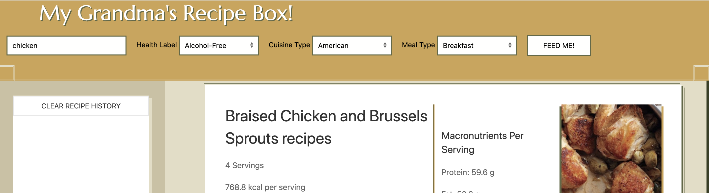

# Koda

## Description

jfeiwoaghejiwoagjeraogjragjriaogjriao;

## Table of Contents

- [Installation](#installation)
- [Usage](#usage)
- [License](#license)
- [Contributing](#contributing)
- [Tests](#tests)
- [Questions](#questions)

## Installation

Step-by-Step Instructions:

1. fjeiwao
2. fjewa

## Usage

Instructions for use:

fewjiaofhewaokfheiowahfgeiwoagheriwoaghrwokavhrkoavhrioavjwaiojewoi

Examples:

- fheiwoaef
- fewkaofjewoa
- fejwkaofejwoa

## License

This project is licensed under the MIT License.

## Collaborating

Collaborators

No Collaborators as of Now

If you would like to contribute to this project please follow the [Contributor Covenant](https://www.contributor-covenant.org/).

Notes: fhewiao

## Tests

Test #1:

- Example:
  Test #2:
- Example:

## Questions

If you have any questions please feel free to contact: Mitchell (fjewoapefwa) at fheiwjao.
